# koishi-plugin-ll-serverinfo-rest-client

[](https://www.npmjs.com/package/koishi-plugin-ll-serverinfo-rest-client)
[](https://www.npmjs.com/package/koishi-plugin-ll-serverinfo-rest-client)

[](https://github.com/VincentZyuApps/koishi-plugin-serverinfo-rest-client/actions)

[](https://github.com/VincentZyuApps/koishi-plugin-serverinfo-rest-client)
[](https://gitee.com/vincent-zyu/koishi-plugin-ll-serverinfo-rest-client)

[](https://koishi.chat/zh-CN/market/)

[](https://qm.qq.com/q/ZN7fxZ3qCq)

<h2>💬 交流反馈</h2>
<p>🐛 Bug 反馈 / 💡 建议 / 👨‍💻 插件开发交流，欢迎加群：</p>
<p><del>💬 插件使用问题 / 🐛 Bug反馈 / 👨‍💻 插件开发交流，欢迎加入QQ群：<b>259248174</b>   🎉（这个群G了）</del></p>
<p>💬 插件使用问题 / 🐛 Bug反馈 / 👨‍💻 插件开发交流，欢迎加入QQ群：<b>1085190201</b> 🎉</p>
<p>💡 在群里直接艾特我，回复的更快哦~ ✨</p>

对接 LeviLamina `serverinfo-rest` 服务端，提供服务器状态、历史玩家、玩家统计、远程命令和白名单绑定功能。

当前版本仅支持服务端 API v2，默认前缀为 `/api/v2`，不兼容 API v1。

> 配套 LeviLamina 服务端：[](https://github.com/VincentZyuApps/levilamina-plugin-serverinfo-rest) [`levilamina-plugin-serverinfo-rest`](https://github.com/VincentZyuApps/levilamina-plugin-serverinfo-rest)，负责在 Minecraft BDS 内提供本插件所需的 HTTP API。

## 指令表格

默认主指令和功能指令前缀均为 `mcinfo1`。中文名称是主指令，英文名称是等价 alias；修改 `commandPrefix` 后两种名称的前缀会一起变化。

| 权限 | 中文主指令 | 英文 alias | 默认完整指令 | 用途 |
| --- | --- | --- | --- | --- |
| 普通用户 | 主指令 | 无 | `mcinfo1` | 查看插件帮助与指令列表 |
| 普通用户（仅 QQ） | `按钮菜单` | `button-menu` | `mcinfo1.按钮菜单 [页码]` | 打开两页 QQ 按钮菜单，页码默认为 1 |
| 普通用户 | `健康检查` | `health-check` | `mcinfo1.健康检查` | 查询服务健康状态与运行时间 |
| 普通用户 | `查在线` | `server-overview` | `mcinfo1.查在线` | 查询 TPS、延迟、在线玩家与版本概览 |
| 普通用户 | `服务器状态` | `server-status` | `mcinfo1.服务器状态` | 查询简要服务器状态 |
| 普通用户 | `服务器信息` | `server-details` | `mcinfo1.服务器信息` | 查询服务器详细信息 |
| 普通用户 | `玩家列表` | `player-list` | `mcinfo1.玩家列表` | 查询在线玩家列表及基本资料 |
| 普通用户 | `玩家数量` | `player-count` | `mcinfo1.玩家数量` | 查询在线玩家数量 |
| 普通用户 | `玩家名列表` | `player-names` | `mcinfo1.玩家名列表` | 仅查询在线玩家名称 |
| 普通用户 | `玩家在线详情` | `player-details` | `mcinfo1.玩家在线详情 <玩家名>` | 查询指定在线玩家的身份、状态、环境、装备和网络质量 |
| 普通用户 | `历史记录` | `player-history` | `mcinfo1.历史记录 [页码]` | 分页查询历史玩家 |
| 普通用户 | `在线图` | `online-chart` | `mcinfo1.在线图 [yyyyMMdd] [--mode text\|image] [--dryrun]` | 查询上海时区单日每小时文字趋势或在线人数折线与进入次数柱形图，日期默认今天 |
| 四级管理员（默认不注册） | `所有Typst图片预览` | `all-typst-image-preview` | `mcinfo1.所有Typst图片预览 [--dryrun]` | 批量生成全部 11 张真实或内置演示数据 Typst 预览图片 |
| 普通用户 | `玩家数据统计` | `player-stats` | `mcinfo1.玩家数据统计 [玩家名]` | 默认查询当前账号绑定的玩家，也可公开查询指定玩家的累计统计 |
| Koishi 权限等级 | `绑定玩家` | `bind-player` | `mcinfo1.绑定玩家 <玩家名>` | 绑定聊天账号与 Xbox 玩家；所需等级由 `whitelistBindingAuthority` 控制 |
| Koishi 权限等级 | `解绑玩家` | `unbind-player` | `mcinfo1.解绑玩家` | 解除当前聊天账号的唯一玩家绑定 |
| 白名单管理员 | `添加白名单` | `add-whitelist` | `mcinfo1.添加白名单 <玩家名> <聊天用户> [--force]` | 代用户创建绑定，并可强制替换冲突 |
| 白名单管理员 | `查询白名单绑定` | `whitelist-binding` | `mcinfo1.查询白名单绑定 <玩家名>` | 查询玩家绑定状态，用户 ID 默认脱敏 |
| 白名单管理员 | `移除白名单` | `remove-whitelist` | `mcinfo1.移除白名单 <玩家名>` | 移除指定玩家的唯一绑定 |
| 命令管理员 | `执行命令` | `execute-command` | `mcinfo1.执行命令 <命令>` | 执行受权限名单控制的 BDS 命令 |

带 `--mode` 选项的查询指令可通过 `--mode text` 或 `--mode image` 临时覆盖默认输出模式。`在线图` 遵循全局 `defaultOutputModes`，文字模式按小时汇总，图片模式生成趋势图；兼容 `在线折线图`、`在线柱形图`、`玩家活动` 和 `player-activity` alias。`查在线`、`历史记录` 和 `玩家数据统计` 使用各自固定输出流程。关闭 `useCommandPrefix` 后，功能指令将去掉 `mcinfo1.` 前缀并注册为顶级指令，单独的 `mcinfo1` 主指令仍会保留。

<!-- TYPST_PREVIEW_GALLERY_START -->
## Typst 图片预览

以下图片由真实服务端数据生成，实例 `mcinfo1-f619e0f2`，服务器标记为 **神秘bds生存服捏**，生成时间为 `2026-07-27T01:49:33.035Z`。

| 说明 | 图片 |
| --- | --- |
| **健康检查**<br>`health-check`<br>展示服务健康状态、时间戳和持续运行时间。 | [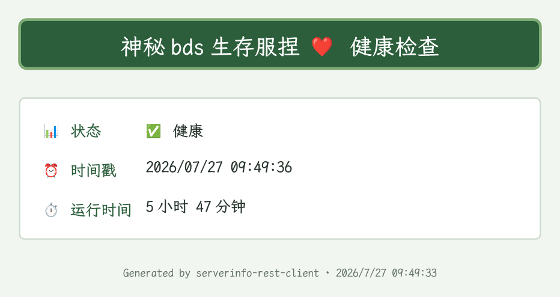](docs/images/preview/健康检查-health-check.png) |
| **查在线**<br>`server-overview`<br>展示在线人数、TPS、查询延迟及服务端版本概览。 | [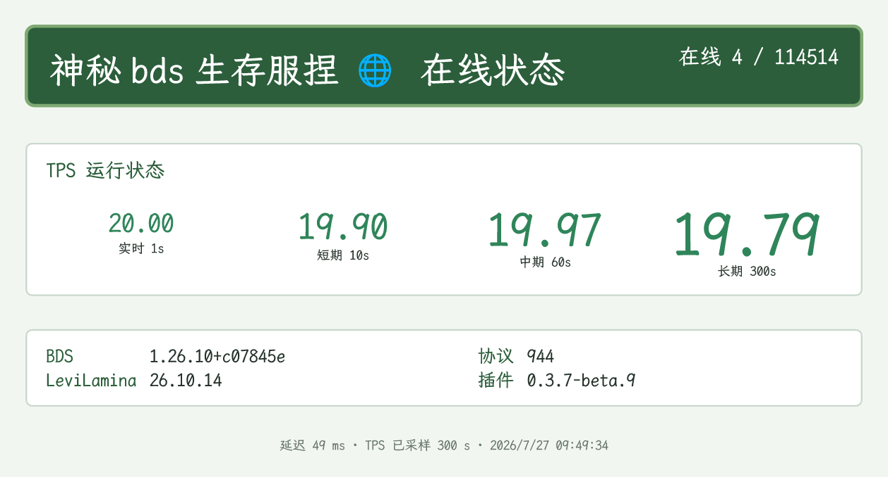](docs/images/preview/查在线-server-overview.png) |
| **历史记录**<br>`player-history`<br>展示历史玩家、累计游玩时间和最后在线时间。 | [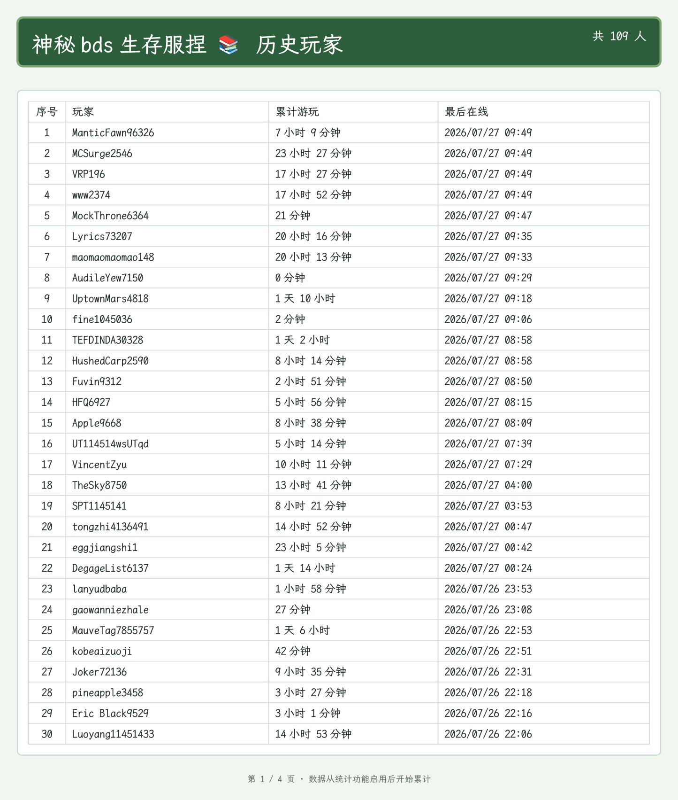](docs/images/preview/历史记录-player-history.png) |
| **在线图**<br>`online-chart`<br>展示在线人数折线、进入次数柱形和单日活动统计。 | [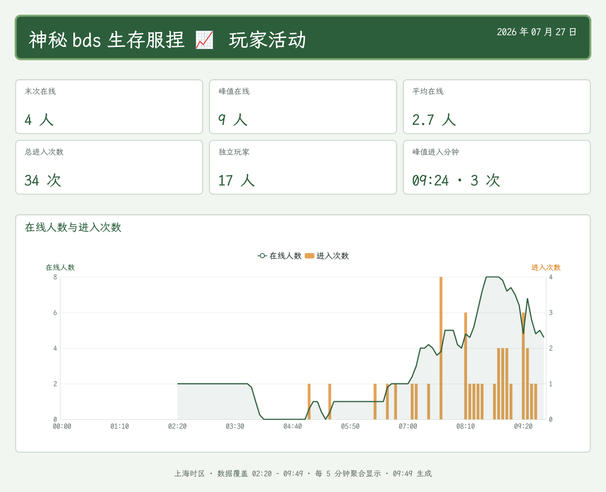](docs/images/preview/在线图-online-chart.png) |
| **玩家数据统计**<br>`player-stats`<br>展示指定玩家的历史游玩、挖掘、击杀和进入次数。 | [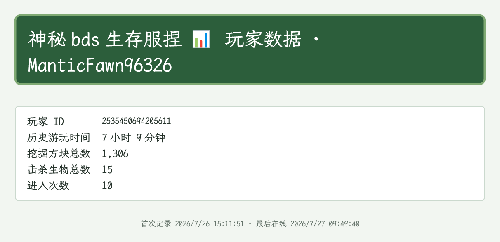](docs/images/preview/玩家数据统计-player-stats.png) |
| **玩家在线详情**<br>`player-details`<br>展示在线玩家的身份、状态、环境和网络快照。 | [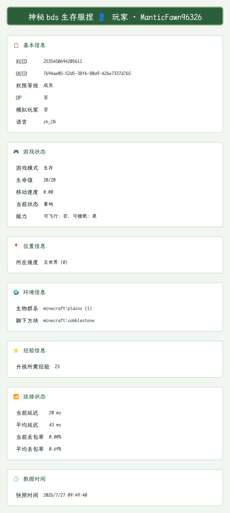](docs/images/preview/玩家在线详情-player-details.png) |
| **玩家列表**<br>`player-list`<br>展示当前在线玩家列表。 | [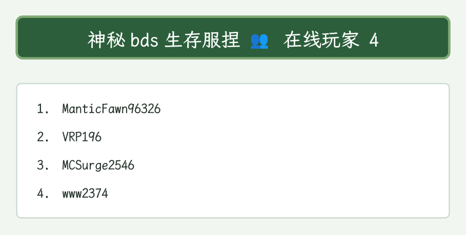](docs/images/preview/玩家列表-player-list.png) |
| **玩家数量**<br>`player-count`<br>展示当前在线玩家数量。 | [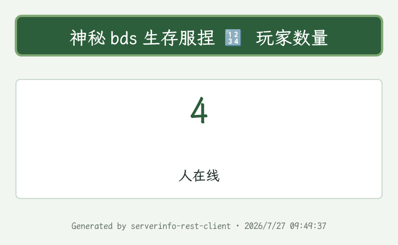](docs/images/preview/玩家数量-player-count.png) |
| **玩家名列表**<br>`player-names`<br>展示当前在线玩家名称列表。 | [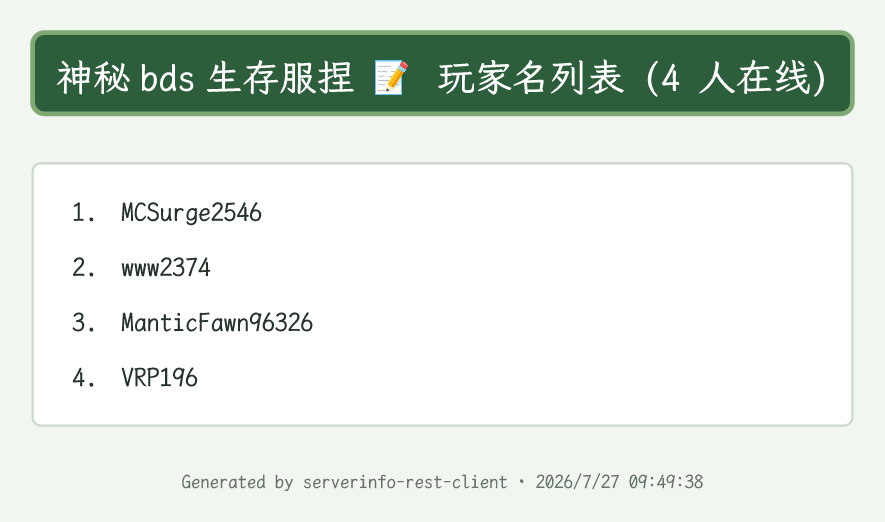](docs/images/preview/玩家名列表-player-names.png) |
| **服务器信息**<br>`server-details`<br>展示存档、在线人数以及 BDS、LeviLamina 和插件版本。 | [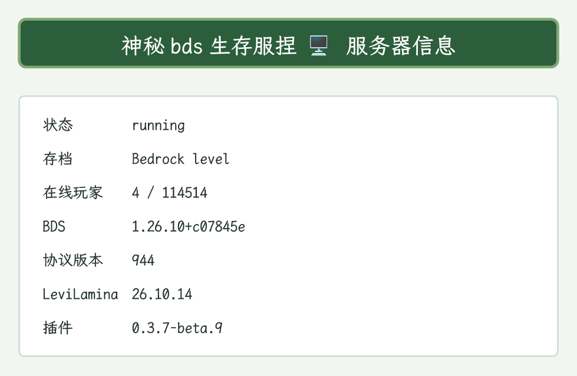](docs/images/preview/服务器信息-server-details.png) |
| **服务器状态**<br>`server-status`<br>展示服务端与客户端版本、在线人数和协议状态。 | [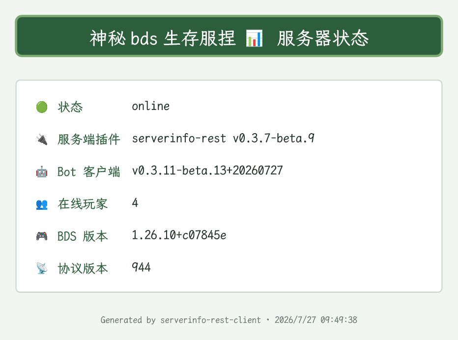](docs/images/preview/服务器状态-server-status.png) |

<!-- TYPST_PREVIEW_GALLERY_END -->

## 配置表格

### 🏷️ 指令与标识配置

| 配置项 | 类型 | 默认值 | 说明 |
| --- | --- | --- | --- |
| `commandPrefix` | 字符串 | `mcinfo1` | 主指令名称；开启功能前缀时也用于组成 `mcinfo1.健康检查` 等指令 |
| `useCommandPrefix` | 布尔值 | `true` | 是否为功能指令添加 `commandPrefix`；关闭后功能指令注册为顶级名称 |
| `enableAllTypstImagePreviewCommand` | 布尔值 | `false` | 是否注册四级权限的“所有 Typst 图片预览”管理指令；不影响 WebUI 画廊 |
| `serverLabel` | 字符串 | `【神秘小服服1】` | 显示在文字、图片和 QQ Markdown 标题中的服务器名称 |

### 🔌 服务器连接配置

| 配置项 | 类型 | 默认值 | 说明 |
| --- | --- | --- | --- |
| `serverUrl` | 字符串 | `http://127.0.0.1:60202` | LeviLamina `serverinfo-rest` HTTP 服务基础地址 |
| `fallbackServerUrlList` | 字符串列表 | `[]` | 同一 REST 服务的备用入口；空值、重复地址及非 HTTP(S) 地址会自动忽略 |
| `serverUrlSelectionStrategy` | 枚举 | `last-success` | 地址选择策略，可选 `forward`、`reverse`、`last-success`、`round-robin` 或 `random` |
| `token` | 密钥 | 空 | 状态、玩家和历史数据等只读 API 的访问令牌 |
| `tokenSendMode` | 枚举 | `header` | 只读令牌发送方式，可选 `param`、`header` 或 `both` |
| `adminToken` | 密钥 | 空 | 命令执行、账号绑定和白名单管理 API 的管理令牌 |
| `adminTokenSendMode` | 枚举 | `header` | 管理令牌发送方式，可选 `param`、`header` 或 `both` |
| `apiPrefix` | 字符串 | `/api/v2` | API v2 路径前缀，必须与服务端一致 |
| `timeout` | 数字 | `10000` | 单次 HTTP 请求尝试的超时毫秒数，范围为 `1000` 至 `60000` |
| `requestMaxAttempts` | 数字 | `5` | 可安全重试请求的最大尝试次数，包含首次请求，范围为 `1` 至 `10` |
| `requestRetryDelayMs` | 数字 | `333` | 每次失败后、下一次安全重试前的等待毫秒数 |
| `requestTotalTimeoutMs` | 数字 | `25000` | 整个安全重试过程的总时间预算，包含请求和等待时间 |

### 🎯 指令细节设置

| 配置项 | 类型 | 默认值 | 说明 |
| --- | --- | --- | --- |
| `hidePlayerCoordinates` | 布尔值 | `true` | 隐藏玩家在线详情中的全部精确坐标，但不隐藏维度 |
| `playerFieldFilters` | 字段表 | 内置 API v2 字段表 | 控制玩家在线详情字段，完整默认值见后文折叠说明 |
| `historyPageSize` | 数字 | `30` | 历史记录每张图片显示的玩家数量，范围为 `1` 至 `100` |
| `commandExecutionAdminList` | 权限表 | `[]` | 可执行 BDS 命令的聊天账号名单 |
| `whitelistManagementAdminList` | 权限表 | `[]` | 可代绑、查询或移除玩家绑定的管理员名单 |
| `whitelistBindingAuthority` | 数字 | `1` | 绑定玩家和解绑玩家所需的 Koishi 权限等级，范围为 `0` 至 `5` |
| `whitelistBindGroupOnly` | 布尔值 | `true` | 是否只允许在群聊中绑定玩家 |
| `whitelistUnbindGroupOnly` | 布尔值 | `false` | 是否只允许在群聊中解绑玩家；默认允许私聊解绑 |

### 📤 输出配置

| 配置项 | 类型 | 默认值 | 说明 |
| --- | --- | --- | --- |
| `enableQuote` | 布尔值 | `true` | 是否引用触发指令的消息；同时控制普通回复、等待提示和 QQ Markdown 的消息关联 |
| `enableWaitingHint` | 布尔值 | `true` | 调用服务端 API 或执行图片渲染时是否立即发送等待提示；根帮助和按钮菜单除外 |
| `defaultOutputModes` | 多选列表 | `["text"]` | 默认输出模式，可选文字和 Typst 图片，也可以同时发送 |
| `typstFallbackToText` | 布尔值 | `false` | Typst 渲染失败时是否补发完整文字结果 |

### 🧩 Typst 渲染配置

| 配置项 | 类型 | 默认值 | 说明 |
| --- | --- | --- | --- |
| `downloadFontsFromRelease` | 布尔值 | `true` | 是否从 Release 自动下载并校验 Typst 字体 |
| `typstFontPath` | 路径 | `data/fonts/LXGWWenKaiMono-Medium.ttf` | 中文字体路径，默认位于 Koishi 根目录下的字体目录 |
| `typstEmojiFontPath` | 路径 | `data/fonts/NotoColorEmoji.ttf` | Emoji 字体路径，默认位于 Koishi 根目录下的字体目录 |
| `typstFontFamily` | 字符串 | `LXGW WenKai Mono` | Typst 使用的字体族名称，必须与字体内部名称一致 |
| `typstTemplateFolderRelativePath` | 只读路径列表 | `["data", "assets", "ll-serverinfo-rest-client", "runtime", "templates"]` | 实验性只读项，仅用于查看相对于 `ctx.baseDir` 的模板路径片段 |
| `typstPreviewOutputFolderRelativePath` | 只读路径列表 | `["cache", "ll-serverinfo-rest-client", "typst-preview"]` | 预览输出固定根目录；实例哈希及 `live`、`dryrun` 子目录由插件追加 |
| `typstRenderScale` | 数字 | `2.33` | 图片渲染倍率，范围为 `1` 至 `10` |
| `typstTransparentBackground` | 布尔值 | `false` | 是否输出透明背景 PNG；关闭时使用页面背景色 |
| `typstPageBgColor` | 颜色 | `#f2f6f1` | 页面背景色 |
| `typstTextColor` | 颜色 | `#26332b` | 正文文字颜色 |
| `typstHeaderFillColor` | 颜色 | `#2c5e3b` | 标题栏填充色 |
| `typstHeaderStrokeColor` | 颜色 | `#7fa973` | 标题栏描边色 |
| `typstHeaderTextColor` | 颜色 | `#ffffff` | 标题栏文字颜色 |
| `typstPanelFillColor` | 颜色 | `#ffffff` | 内容面板填充色 |
| `typstPanelStrokeColor` | 颜色 | `#cbd9ce` | 内容面板描边色 |
| `typstSectionTitleColor` | 颜色 | `#2c5e3b` | 小节标题颜色 |
| `typstStatsTextColor` | 颜色 | `#66746b` | 统计信息文字颜色 |

### 🤖 QQ Markdown 与按钮适配配置

| 配置项 | 类型 | 默认值 | 说明 |
| --- | --- | --- | --- |
| `qqMarkdownEnabled` | 布尔值 | `true` | QQ 查询结果是否使用原生 Markdown；不影响按钮菜单和独立 Keyboard 消息 |
| `qqKeyboardEnabled` | 布尔值 | `true` | 是否启用查询键盘和“按钮菜单”指令；独立于 Markdown 开关 |
| `qqMarkdownEmbedImage` | 布尔值 | `false` | 是否将图片通过公网 URL 嵌入 QQ Markdown；关闭时使用普通 QQ 图片消息 |
| `publicBaseUrl` | 字符串 | 空 | QQ Markdown 临时图片公网根地址；留空时回退 Koishi `server.selfUrl` |
| `qqImageCacheTtlMinutes` | 数字 | `15` | QQ Markdown 临时图片保留分钟数，最小值为 `1` |
| `qqImageCacheMaxFiles` | 数字 | `50` | 每个插件实例最多保留的 QQ Markdown 图片数量，最小值为 `1` |
| `qqMarkdownMaxPlayers` | 数字 | `50` | QQ Markdown 在线玩家名单最大展示人数，最小值为 `1` |
| `qqMarkdownKeyboardJson` | JSON 字符串 | 内置默认键盘模板 | “查在线”键盘模板，支持 `${commandPrefix}` 和 `${serverLabel}` 变量；按钮菜单不读取此项 |

### 🛠️ 调试选项

| 配置项 | 类型 | 默认值 | 说明 |
| --- | --- | --- | --- |
| `verboseConsoleLog` | 布尔值 | `false` | 输出 API 摘要、Typst 诊断、QQ 图片缓存路径和完整临时公网 URL |

## 专题说明

> **🚀 快速接入与连接配置**
>
> 1. 安装并启动 BDS、LeviLamina 和配套的 `serverinfo-rest` 服务端插件，并确认健康检查接口可以访问。
> 2. 将 `serverUrl` 填为 HTTP 服务地址，例如 `http://127.0.0.1:60202`。
> 3. 同一服务存在多个公网入口时，将其他完整基础地址加入 `fallbackServerUrlList`；不要填写其他 Minecraft 服务器。
> 4. 保持 `apiPrefix` 与服务端一致；API v2 默认使用 `/api/v2`，本客户端不兼容 API v1。
> 5. 服务端启用只读认证时填写 `token`；使用绑定、白名单或命令管理功能时还需要填写 `adminToken`。
> 6. 按需设置 `commandPrefix`、`useCommandPrefix` 和 `serverLabel`；多个实例可以分别使用 `mcinfo1`、`mcinfo2`。
> 7. Koishi 与 BDS 不在同一台机器时，确认服务端监听地址、防火墙和网络路由允许 Koishi 访问对应端口。

> **🛟 多地址故障转移与安全重试**
> `serverUrl` 始终是地址池中的主地址，备用列表只为同一个 REST 服务提供其他入口。默认 `last-success` 会优先使用当前插件实例内存中最近成功的地址；插件重载后重新从主地址开始。

- `forward` 每次按主地址到备用地址的正序尝试；`reverse` 每次从最后一个备用地址开始。
- `last-success` 首次使用正序，之后从最近成功地址开始；`round-robin` 每条逻辑请求轮换一次起始地址。
- `random` 按轮洗牌，同一轮不会重复地址；地址用完后才会开始下一轮。
- 所有 GET 以及显式标记为只读的 POST 可以重试；执行命令、绑定、解绑和白名单写入 POST 只发送一次，避免响应丢失时重复执行。
- 网络错误、单次超时、`HTTP 408`、`425`、`429` 和 `5xx` 可以重试；其他 `4xx` 会直接返回，避免掩盖参数或令牌错误。
- `requestMaxAttempts` 和 `requestTotalTimeoutMs` 都是硬上限，任意一个先达到都会停止；最后一次失败后不会继续等待重试间隔。
- 固定公网 IP 可能随端口映射服务调整而变化，备用列表属于可用性兜底，长期跨网连接仍建议使用稳定隧道或专线。

> **🔐 Token、权限与白名单**
> 推荐为只读接口和管理接口使用不同的随机令牌，并优先通过 Bearer Header 发送。

<details>
<summary><strong>查看 Token、权限与白名单详细说明（点击展开）</strong></summary>

- `token` 用于服务器状态、玩家和历史数据等只读接口；`adminToken` 用于绑定玩家、解绑玩家、白名单管理和远程命令接口。
- `tokenSendMode` 和 `adminTokenSendMode` 可分别设为 `param`、`header` 或 `both`。`param` 使用 URL 参数，`header` 使用 `Authorization: Bearer ...`，`both` 同时使用两种方式。
- 客户端两种发送模式默认都是 `header`；服务端只读接收模式默认 `both`，管理接收模式默认 `header`，两端配置必须兼容。
- 使用 `param` 或 `both` 时，token 会进入 URL。客户端调试日志会遮盖 token，但反向代理和其他网络组件仍可能记录完整地址，公网环境应使用 HTTPS。
- 即使客户端填写了 `adminToken`，服务端仍可独立关闭远程命令、账号绑定或白名单管理接口。
- 权限表使用 `userId` 精确匹配；`platform`、`channelId` 和 `selfId` 留空表示不限制对应范围，`enabled` 控制该行是否生效。
- `绑定玩家` 和 `解绑玩家` 受 `whitelistBindingAuthority` 与群聊限制配置控制；管理员白名单操作与命令执行分别使用 `whitelistManagementAdminList` 和 `commandExecutionAdminList`。
- API v2 只有“已绑定”和“未绑定”两种状态。一个聊天账号只能绑定一个 Xbox 玩家，一个 Xbox 玩家也只能绑定一个聊天账号。
- 服务端启用 `syncBindingsToBdsAllowlist` 时，绑定和解绑会同步修改 BDS allowlist；关闭同步时只维护聊天账号与 Xbox 玩家的关系。
- `添加白名单 <玩家名> <聊天用户>` 支持艾特或纯 userId。绑定冲突默认返回 `409`，管理员显式使用 `--force` 时会替换双方冲突绑定。
- 关闭 BDS allowlist 同步后，不会自动清理已经存在的名单项目，避免误删管理员手工维护的记录。
- 绑定数据只保存在对应服务端插件的 `player-data.json` 中，Koishi 不建立数据库镜像。
- `玩家数据统计` 不传玩家名时使用当前聊天账号绑定的玩家；显式提供玩家名时保持公开查询，不要求绑定关系。

</details>

> **⌨️ QQ Markdown 与按钮菜单**
> `qqMarkdownEnabled` 控制 Markdown 正文，`qqMarkdownEmbedImage` 控制图片是否嵌入 Markdown，`qqKeyboardEnabled` 独立控制按钮功能。

<details>
<summary><strong>查看 QQ Markdown 与按钮菜单详细说明（点击展开）</strong></summary>

- `按钮菜单 [页码]` 仅支持 `qq` 平台；即使关闭 `qqMarkdownEnabled`，仍可在 `qqKeyboardEnabled` 开启时主动打开菜单。
- `查在线` 使用 `qqMarkdownKeyboardJson` 自定义键盘；`在线图`、`历史记录` 和 `玩家统计` 使用各自动态生成的操作键盘。
- 关闭 `qqMarkdownEnabled` 但开启 `qqKeyboardEnabled` 时，普通图文发送完成后会追加一条仅承载操作按钮的 Markdown 消息。
- 开启 `qqMarkdownEnabled` 但关闭 `qqMarkdownEmbedImage` 时，先发送普通图片，再发送 Markdown 正文和 Keyboard；第二条消息不重复引用原消息。
- 普通 QQ 图文固定按照“引用、单张图片、文字”的顺序组装，每条消息最多包含一张图片。
- 第 1 页使用两列四行展示八个服务器与概览入口，第 2 页使用两列四行展示七个玩家与账号入口。
- 添加白名单、查询白名单绑定、移除白名单和执行命令不会出现在普通用户菜单中。
- 两页底部固定显示上一页和下一页；边界红叉按钮仍可点击，并会提示已经位于第一页或最后一页。
- 绑定玩家、玩家在线详情和解绑玩家按钮只填入指令，不会立即发送，以便补充参数或避免误触。
- 关闭功能指令前缀后，功能按钮自动改用顶级指令，根按钮仍使用配置的 `commandPrefix`。
- 仅当 `qqMarkdownEnabled` 与 `qqMarkdownEmbedImage` 同时开启时，查询图片才会写入 `cache/ll-serverinfo-rest-client/<实例键>/`，再通过 Koishi server 暴露为临时公网 URL。
- `publicBaseUrl` 必须能够被 QQ 官方服务器直接访问；推荐使用具有有效证书的 HTTPS 域名和标准 `443` 端口。浏览器可以打开并不保证 QQ 图片代理一定允许抓取。
- 图片会按照 `qqImageCacheTtlMinutes` 和 `qqImageCacheMaxFiles` 清理，过期或被清理后的旧消息图片可能无法再次加载。

</details>

> **📈 玩家活动趋势**
> `在线图 [yyyyMMdd]` 使用服务端持久化数据输出每小时文字趋势或绘制在线人数折线与进入次数柱形图，不依赖 Koishi Database 或浏览器服务。

<details>
<summary><strong>查看玩家活动采集与图表说明（点击展开）</strong></summary>

- 不传日期时查询上海时区当天 `00:00` 至当前时刻；指定日期时只接受严格的 `yyyyMMdd`，例如 `20260725`。
- 该指令支持 `--mode text` 和 `--mode image`；未显式指定时遵循全局 `defaultOutputModes`，全局同时选择文字与图片时会同时输出两种结果。
- 文字模式按上海时区自然小时展示有效心跳平均在线、峰值在线和进入次数；过去日期最多 `24` 行，今天只展示已经到达的小时。
- 图片模式将一分钟数据聚合为五分钟图表点，并生成在线人数折线与进入次数柱形图；没有数据时仍会输出状态图片。
- `-d`、`--dryrun` 和 `--dry-run` 使用内置确定性演示数据，完全跳过服务端 API；dryrun 只替换数据来源，仍然遵循全局或显式 `--mode`。
- 查看完整渲染效果可执行 `在线图 --dryrun --mode image`；图片、文字和 QQ Markdown 都会标记 `DRY RUN · 内置演示数据`。
- 未来日期会提示“暂不支持预知未来”；有效日期没有数据时仍会生成带无数据状态的 Typst 图片。
- C++ 服务端每个自然分钟保存一次在线人数心跳，并记录每次玩家进入事件；同一玩家反复重连会重复计入进入次数。
- 玩家活动原始文件由服务端保存在 `player-activity-history/YYYYMMDD.jsonl`，Koishi 不建立第二份数据副本。
- 服务端配置 `playerActivityHistoryRetentionDays` 默认保留 `365` 天；设置为 `0` 或负数表示永久保存。
- Dryrun 演示数据包含在线人数起伏、进入次数和缺失心跳区间，可用于检查双 Y 轴、柱形和折线断开效果。
- 五分钟图表点的在线人数取有效心跳平均值，进入次数取区间总和。
- 心跳缺失的区间使用空值并断开折线，不会把 BDS 停机伪装成零人在线。
- 图表展示末次在线、峰值在线、平均在线、总进入次数、独立玩家数和峰值进入分钟。
- ECharts 通过 Node SVG SSR 在本地生成组合图，再由 Resvg 使用本地字体转为高分辨率透明 PNG，并通过 Typst `mapShadow()` 嵌入模板；整个过程不依赖浏览器或 CDN。
- ECharts 图表生成失败时，图片上方显示错误占位，下方统计信息仍由 Typst 正常排版。
- QQ 日期键盘提供前一天、今天或刷新、后一天；今天的后一天按钮会返回未来日期提示，dryrun 和显式 mode 状态会在翻页时保留。

</details>

> **👤 玩家在线详情字段**
> 文字和 Typst 图片共用 API v2 字段过滤器，敏感网络标识不会进入接口响应。

<details>
<summary><strong>查看玩家字段与过滤规则（点击展开）</strong></summary>

`玩家在线详情 <玩家名>` 调用 `GET /api/v2/player?name=<玩家名>`。服务端在 BDS 主线程定期刷新玩家快照，客户端通过 `playerFieldFilters` 决定展示内容。

默认开启字段：

`name`、`xuid`、`uuid`、`permissionLevel`、`isOperator`、`isSimulated`、`locale`、`gameMode`、`health`、`maxHealth`、`speed`、`isFlying`、`isSneaking`、`isSprinting`、`isMoving`、`isSwimming`、`isInLava`、`isOnGround`、`isOnFire`、`isSleeping`、`isGliding`、`isRiding`、`isInvisible`、`canFly`、`canSleep`、`position.dimensionId`、`biome`、`standingOn`、`expNeededForNextLevel`、`network.currentPingMs`、`network.averagePingMs`、`network.currentPacketLoss`、`network.averagePacketLoss`、`snapshotAtMs`。

默认关闭字段：

`uniqueId`、`position`、`blockPosition`、`feetPosition`、`lastDeathPosition`、`respawnPosition`、`rotation`、`mainHand`、`offHand`、`armor`、`device.platform`、`device.inputMode`。

- 精确坐标同时受 `hidePlayerCoordinates` 总开关和对应字段开关控制，维度信息不受坐标隐藏影响。
- 主手、副手、盔甲、设备平台和输入方式受支持，但默认关闭显示。
- IP、客户端 ID 和服务器地址不会由 API 返回，也不能通过字段配置开启。
- API v2 使用 `isOperator`、`locale` 和 `position` 等规范键；旧 `isOP`、`langCode` 和 `pos` 等配置键不会迁移或生效。

</details>

> **🧩 输出模式、字体与 Typst 模板**
> Typst 完全在本地渲染，不依赖在线渲染服务；默认模板和主题均可配置。

<details>
<summary><strong>查看输出模式、字体与 Typst 模板详细说明（点击展开）</strong></summary>

- `defaultOutputModes` 可以选择文字、Typst 图片或同时发送两种输出；带 `--mode` 选项的查询指令可通过 `--mode text` 或 `--mode image` 临时覆盖。
- `enableQuote` 控制根帮助、按钮菜单、成功结果、错误提示和等待提示是否引用触发消息；QQ Markdown 也只在该配置开启时关联原消息。
- `enableWaitingHint` 开启时，调用服务端 API 或执行图片渲染的指令会立即发送“正在处理服务器请求”提示，并在操作结束后删除；根帮助、按钮菜单以及参数、平台或权限前置校验失败不会显示等待提示。
- 首次启动时可从 Release 自动下载并校验霞鹜文楷 Mono 与 Noto Color Emoji 字体；也可以配置已有字体路径。
- 渲染倍率、背景、正文、标题栏、内容面板、小节标题和统计文字颜色都可以在插件配置页调整。
- `typstTransparentBackground` 默认关闭，此时使用 `typstPageBgColor`；开启后 PNG 保留透明背景。
- 插件发布包中的 `templates/` 保存默认模板，启动时会复制到共享运行目录：

```text
data/assets/ll-serverinfo-rest-client/runtime/templates
```

- `mcinfo1`、`mcinfo2` 等多个插件实例共享同一个运行时模板目录。
- 插件每次出图都读取运行目录中的 `.typ` 文件，修改后下一次渲染即可生效。
- `player-activity.typ` 负责玩家活动统计卡和 ECharts 图表布局，临时图表只存在于 Typst shadow asset 中，不会写入运行目录。
- 启动同步只补充缺失文件，不覆盖用户已经修改的模板；检测到已知旧版默认模板时会先备份再修复。
- 旧版 `player-detail.typ` 会单独备份为 `player-detail.typ.backup-YYYYMMDD-HHmmss`，再替换为兼容 API v2 的模板。
- `typstTemplateFolderRelativePath` 是实验性只读项，仅用于查看相对于 `ctx.baseDir` 的路径片段。
- 插件详情页提供“恢复默认模板”按钮，操作需要 Koishi authority 4，并在执行前进行二次确认。
- 插件详情页同时提供“生成真实预览”和“生成演示预览”按钮；authority 4 管理员可以在横向画廊中查看全部 11 张图片。
- 目标模式没有预览图片时会直接生成；已有图片时浏览器会先显示覆盖确认对话框，取消后不会发起生成请求。
- 点击画廊图片或“图片”按钮会复制原始全分辨率 PNG；每张卡片另有“路径”和“信息”按钮，分别复制服务器绝对路径和格式化 JSON 元数据。
- PNG 剪贴板需要 HTTPS、localhost、Koishi Desktop 等安全上下文及浏览器 `ClipboardItem` 支持；不满足条件时只显示错误，不会自动下载文件。
- 真实预览使用当前实例的 REST 地址池、选择策略、API 前缀与 token；玩家在线详情选择第一名在线玩家，玩家统计优先选择第一名在线玩家并回退到历史记录第一页第一名玩家。
- 真实模式没有在线玩家时会跳过玩家在线详情并记录原因；演示模式完全不请求服务端 API，所有图片都会标记 `DRY RUN · 内置演示数据`。
- `所有Typst图片预览` 指令默认不注册；开启 `enableAllTypstImagePreviewCommand` 后可使用 `-d`、`--dryrun` 或 `--dry-run` 生成演示预览，聊天指令要求 authority 4，WebUI 预览接口不额外限制 Console 权限。
- 每个实例使用 `commandPrefix` 和 SHA-256 前八位组成稳定目录键，避免 `mcinfo1`、`mcinfo2` 等可复用实例相互覆盖。
- 预览分别写入 `cache/ll-serverinfo-rest-client/typst-preview/<实例键>/live` 和 `dryrun`；每个模板只保留固定名称的一张 PNG，并通过 staging 目录整轮替换。
- 每轮输出包含 `metadata.json`，记录生成时间、成功、跳过、失败、所选玩家及每张图片的绝对路径、MIME、字节数、宽高和 SHA-256。
- 恢复前会将原目录完整备份为 `templates-backup-YYYYMMDD-HHmmss`，恢复后清理 Typst 编译缓存。
- 备份不会自动删除，可在确认新模板正常后手动整理；直接修改模板仅建议熟悉 Typst 的用户使用。

</details>

> **🐛 调试日志与公网图片安全**
>
> `verboseConsoleLog` 默认为 `false`。开启后会输出脱敏后的 API 请求地址与响应摘要、Typst 和字体诊断、QQ 图片缓存路径、图片大小、Markdown 参数以及完整临时图片 URL。URL 参数中的 token 会被遮盖，但 API 响应可能包含玩家资料，临时图片 URL 在缓存有效期内也可直接访问，因此不要将完整生产日志发送到群聊、Issue 或其他公开位置。
